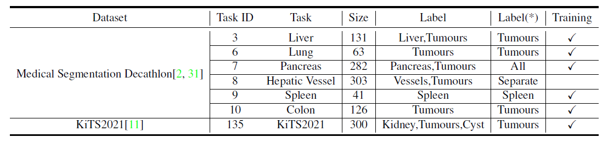

# Continual Learning Based on nnUNet

For the detailed information about how to run nnUNet (e.g. installation, debugging, etc.), please 
refer to the original readme file provided by its authors: [readme_nnUNet.md](readme_nnUNet.md). 
It is highly recommended that you have a look at it and try to run some examples before reading 
this document.


## 1. Installation
Please refer to the Installation section in [readme_nnUNet.md](readme_nnUNet.md) to install the required 
libraries and set necessary environment variables.

## 2. Data Preparation



In the table above, we list the datasets in our experiments. You can download the datasets here: 
[Medical Segmentation Decathlon](http://medicaldecathlon.com/), [KiTS2021](https://kits21.kits-challenge.org).

nnU-Net expects datasets in a structured format. This format closely (but not entirely) follows the data 
structure of the [Medical Segmentation Decthlon](http://medicaldecathlon.com/). See [here](documentation/dataset_conversion.md) 
for detailed explanation. For Medical Segmentation Decthlon, you can directly put it in your raw data 
directory but some trivial modification is still required. You should rename all the training images to 
be ending up with '0000.nii.gz' ('0000' is the indexing of modality. For example, you should rename 
`liver_0.nii.gz` to `liver_0_0000.nii.gz` so that nnUNet can understand your dataset organization). 
Only modification on training images in folder `imagesTr` is needed, labels files should be kept as it is. 
We don't provide code to do such modification since it is not complicated.

For KiTS2021 dataset, we provide this [script](nnunet/dataset_conversion/Task135_KiTS2021.py) to 
automatically handle data conversion. Modifying the data directory path in the script to match your storing
position and run it, then everything is done.

## 3. Data Preprocessing and Experiment Planning.
Provided that the requested raw dataset is located in the correct folder (`nnUNet_raw_data_base/nnUNet_raw_data/TaskXXX_MYTASK`,
also see [here](documentation/dataset_conversion.md)), you can run this step with the following command:

As can be seen in the table in Section 2, for task 6,8,9,10, we stick to their original labels. Therefore 
you can directly run the original nnunet experiment and preprocess command as follows:

```bash
nnUNet_plan_and_preprocess -t XXX --verify_dataset_integrity --planner2d None
```

`XXX` is the integer identifier associated with your Task name. You should set the argument `--planner2d` 
as `None` since we only run 3D U-Net in our experiments. Performance with 2D U-Net is not tested. 
Although this experiment planner is only intended to handle task 6,8,9,10, we recommend you run it on all the 
datasets to verify the dataset and integrity and inspect the dataset property.

One more thing to take care is that you need to mannually add '_nointeract' before '.pkl' in the name of generated 
plans file to meet the requirements of training codes. (i.e. rename `nnUNetPlansv2.1_plans_3D.pkl` in each 
task folder in your preprocessed data path to `nnUNetPlansv2.1_plans_3D_nointeract.pkl`). We will add this 
into the code in the future, but right now you only need to rename four files so it should be easy.

For task 3,7,135, since we choose new foreground labels for them, the following scripts should be ran to modify
the label space and generate new preprocessed data.

```bash
cd experiment_planning
python nnUNet_plan_preprocess_for_interact.py -t 3 --nointeract --fgcls 2
python nnUNet_plan_preprocess_for_interact.py -t 7 --nointeract --fgcls all
python nnUNet_plan_preprocess_for_interact.py -t 135 --nointeract --fgcls 2
```

Argument `--fgcls` is designed to select the class indices that compose the new foreground class. You can see 
`nnUNet_plan_preprocess_for_interact.py` to find more argument options. This file is initially designed for
interactive learning where foreground and background clicks are sampled and distance map is generated and concatenated
accordingly, based on [this work](https://arxiv.org/abs/1603.04042). Since we don't apply interactive learning
in the end, some related arguments are not useless and not tested. Instead, you should set the flag `--nointeract`
to be true to avoid other settings.

After running these scripts, you should be able to find all the preprocessed images in your preset precessing data path.

## 4. Continual Learning

Different from original nnUNet, we do not use 5-fold cross validation and only select the last 1/5 of training data
as our validation set. The argument `--fold` should always be `0` in our experiments. Also, since we only run our experiments
on low resolution images, the argument `network` is `3d_lowres` in our case. Other choices are not tested.

The codes also contain some arguments for interactive learning but they are not used. Same as in Section 3,
`--nointeract` should be passed.


#### Training
```
cd run
python run_training_continual_multi_dataset.py 3d_lowres nnUNetTrainerV2_Continual_MultiDatasets\
	--nointeract --start_task XXX\
	--exp_name your_exp_name\
	--sample_dataset \
	--num_epochs 500 \
	--method EWC --lambda_ewc 1e7 \
```

`XXX` is the integer identifier associated with your Task name of the starting task. Set it as `3` to train
sequentially from task 3. When training stops at some intermediate task, you can resume training by setting
`--start_task` as where you stop and pass `-c` or '--continue_training'. `--exp_name' is designed to distinguish
different experiments and it is useful if you want to try different configurations.

Note that in original nnUNet, the training steps for each epoch are fixed to be 250. Instead, we follow the usual
training protocol that at each epoch, all the training data will be iterated once. The total number
of epochs for each stage of continual learning by the argument `--num_epochs`. Also, for simplicity, we choose to
randomly sample 50 training images and 12 images for validation, you can pass `--sample_dataset` to follow this 
setup. 

We implement three continual learning methods in our trainer. Passing `--method` to set it. The choices include
`None`, `EWC` and `BLIP`, `None` being chosen by default and indicating simply finetuning the model at each stage.
You can refer to their paper ([EWC](https://arxiv.org/abs/1612.00796); [BLIP](https://arxiv.org/abs/2105.04444))
and the training script [here](nnunet/run/run_training_continual_multi_dataset.py) to decide how you would like to
tune the hyperparameters.

#### Evaluating
We separate the training and validation step in our code. Now you need to manually run the evaluation script
after training is done, as follows.

```
cd run
python run_training_continual_multi_dataset.py 3d_lowres nnUNetTrainerV2_Continual_MultiDatasets\
	--nointeract --start_task XXX\
	--exp_name your_exp_name\
	--sample_dataset \
	--num_epochs 500 \
	--method EWC --lambda_ewc 1e7 \
	-val \
	--pretrained_weights your_pretrained_checkpoint_path \
```

`--pretrained_weights` should be set as the path of checkpoint at the final stage if you want to evaluate
how much the previous tasks are remembered after the final stage. Otherwise, the model will be evaluated on
each dataset using the checkpoint stored at the corresponding stage, namely to evaluate how much the model
learns for each new task.

## 5. Training the Baselines and Finetuning the Backbone.

#### Training
Run the following script to train the model for the chosen dataset. 
```bash
cd run
python run_training_interactive.py 3d_lowres nnUNetTrainerV2_Interactive XXX 0\
	-p Plans_for_task_XXX \
	--nointeract --disable_next_stage_pred --sample_dataset \
	--exp_name your_exp_name\
	--pretrained_weights your_pretrained_checkpoint_path 
```
Note that you need to specify the experiment planner for each task `XXX` by setting the argument `-p`. For task
3,7,135, it should be `nnUNetPlans_interactive` and for task 6,8,9,10, it should be `nnUNetPlansv2.1`.

If `pretrained_weights` is not specified, then the backbone is not initialized with any pretrained backbone.
You are then training the baselines for each dataset. To start with the pretrained backbone obtained by continual
learning in Section 4, you should set it as the checkpoint path at the final stage of training.

The model will be evaluated at the end of training automatically using the latest checkpoint, but if you
want to evaluate using the best checkpoint stored during training, please refer to the following script.

#### Evaluation
```bash
cd run
python run_training_interactive.py 3d_lowres nnUNetTrainerV2_Interactive XXX 0\
	-p Plans_for_task_XXX \
	--nointeract --disable_next_stage_pred --sample_dataset \
	--exp_name your_exp_name \
	--valbest \  
```
